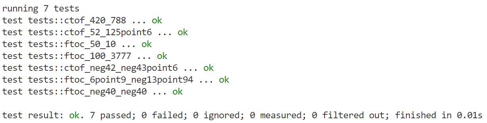
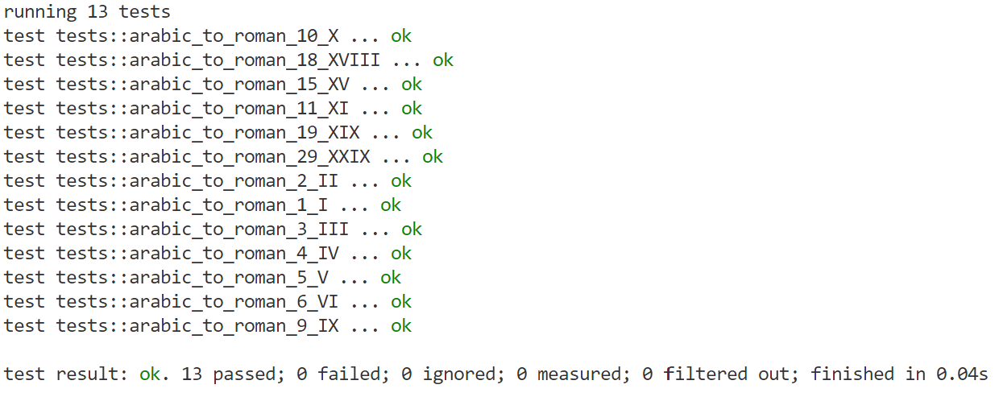
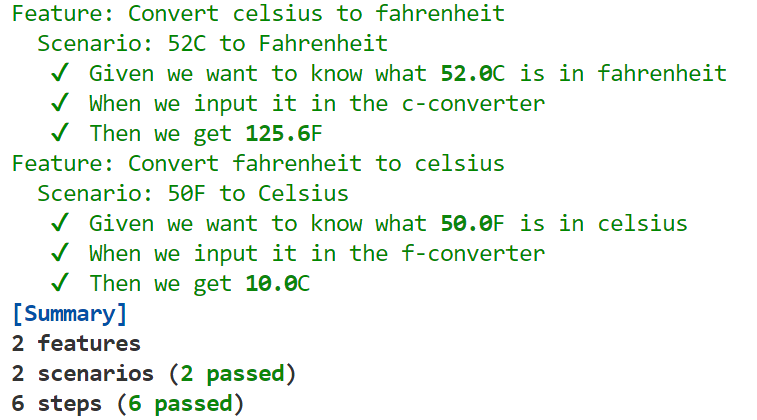
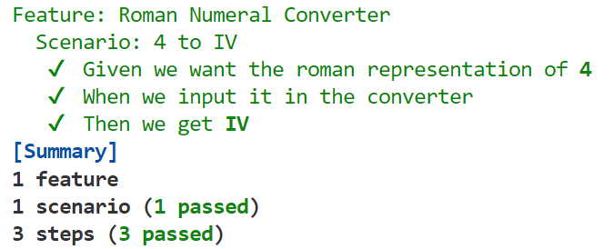

# Readme

Repository for Test Assignment 1, using BDD for two Katas.
Solutions to Katas are found in /temperature-converter and /numeral-converter.
Solutions are developed in Rust.

Gherkin .feature files are found in /features folder inside either project.
Tests are found in /tests folder of either project, and kata solutions in /src folder.

To run unit tests, navigate to folder of either of the projects and run:
```
cargo test --test unittests
```
and to run acceptance tests, run:
```
cargo test --test acceptancetests
```

# Assignment 1

## 1. Reflections

### 1. Shooting
*A woman fired a shot at a man with her gun, but the man did not die. List the possible reasons for the man not dying.*
1. The shot was fired at the man, but it never specified that he was hit.
2. Even if he was hit, he might've been hit somewhere non-lethal.
3. Even if he was hit somewhere typically lethal, he might've gotten life-saving first aid immediately.
4. He might've been already dead, therefore he could not die at that moment.
### 2. Alien
*An alien meets you and it asks you to teach it how to brush its teeth. Assume that the alien has teeth exactly like yours, and is as smart as you, but it needs a clear step-by-step instruction. List the steps. Be as detailed as you can.*
1. Take your toothpaste-tube in your non-dominant hand, so that the cap is accessible.
2. With your dominant hand, unscrew the cap counter-clockwise, and once the cap comes off, put it to the side. 
3. Move the toothpaste-tube to your dominant hand.
4. Take your toothbrush in your non-dominant hand, holding the end without brustles in your hand. 
5. Hold the toothpaste-tube, so that the end that was covered by a cap is above the brustles of the toothbrush.
6. Press gently on the toothpaste-tube until toothpaste comes out. Leave a pea-sized amount of toothpaste on the brustles of the toothbrush.
7. Put aside the toothpaste-tube, and bring the brustles end of the toothbrush to your mouth
8. Open your mouth and put the toothbrush on the top of your bottom-row of teeth, starting in your right side of the mouth. Gently close your mouth and gently brush the top of your teeth by moving the toothbrush right-to-left while making contact between your teeth and the brustles on the toothbrush.
9. Brush your right third of your bottom set of teeth for 20 seconds, then move to the middle third of your bottom set of teeth and repeat the brushing in that area for 20 seconds. Then move on to the left third and repeat for another 20 seconds.
10. Once finished, turn the toothbrush so that the brustles point up. Then repeat the process on your top row of teeth, like you did with your bottom row.
11. Once finished, take the toothbrush out of your mouth and clamp your teeth together. While doing so separate your lips, so that the sides of your teeth are exposed. Now turn the toothbrush sideways so that the brustles point at the outer side of your teeth. Brush first the right third for 20 seconds, then the middle third and then the left. 
12. Spit out the toothpaste, and rinse the brustles of the toothbrush until the toothpaste is gone. Then put aside your toothbrush and put the cap of the toothpaste back on the tube, by screwing it the opposite direction as you did before.

## 3. Thoughts on BDD
### 1. What was positive and good about BDD?
Because of the way new features are developed, you naturally end up with a library of regression tests, which helps make sure that any changes don't break existing functionality. Additionally it helps atomise functionality, because it is necessary for testing to be possible. In theory, it should also help with communication with a client, since the client will have acceptance tests that they can themselves verify are fulfilled, but that wasn't a positive I felt in this assignment. 
### 2. What was annoying or difficult?
Working with BDD in a scope as small as this feels artificially formal. The result was that the acceptance tests were identical to the unit tests, which means I wasn't actually doing BDD but just TDD. For BDD to have any effect, a system more complex than a single function is required. 

Additionally, Working in a very type-strict language makes BDD and TDD a lot more annoying. In loosely typed languages the compiler doesn't get in the way in the same way:
When writing the temperature converter I initially wrote the test to provide an integer and expect an integer returned. However, in my second test, the result contained a decimal, which meant I had to rewrite my function AND my first test to use floating point numbers instead. A loosely typed language would've just converted the floats to ints in the first test, meaning I wouldn't have had to rewrite it. 
On the other hand, having to be strict about my use of types also means that there are less possible errors I'll have to test for. I know exactly what type I expect and return, it is up to the user to convert their numbers to floats correctly. I therefore don't have to test for that conversion.
### 3. What surprised you?
I was surprised at how helpful TDD is surrounding problem solving. It forces one to break problems down in small bits. However, this doesn't work well for mathematical functions that are just an implementation of a formula, since these don't lend themselves to an iterative approach. 
### 4. Did BDD help you understand the problem domain more?
BDD didn't, but TDD did. As I mentioned, it helped break the problem down into bits that could be implemented separately. However, it also resulted in a sub-optimal solution, so in the future I should spend more time on the refactoring step.
### 5.  Did BDD help you write some tests you wouldn’t otherwise have thought of? 
Not really, no. I think that's partly the fault of the narrow domain of inputs and outputs of the given Katas, and partly the fault of the fact that I used a very type-strict language, which meant I didn't have to handle a lot of potential errors related to loose typing.

# Test Results
## Unit Test Results:
### Temperature Converter


### Numeral Converter


## Acceptance Test Results
### Temperature Converter


### Numeral Converter

